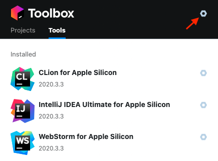
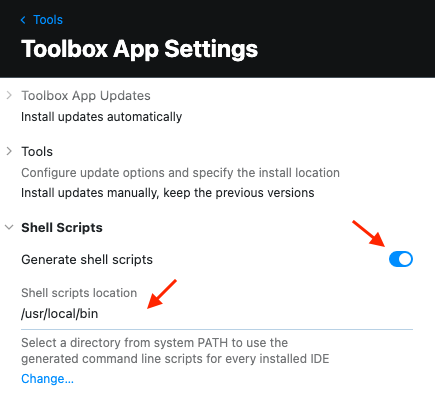
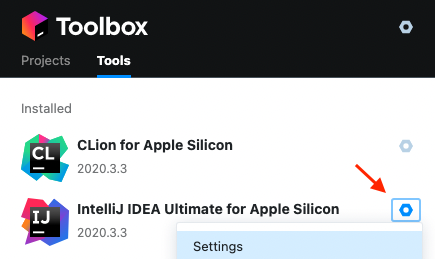
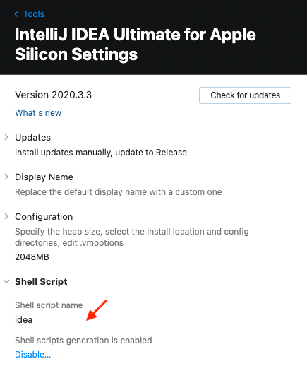
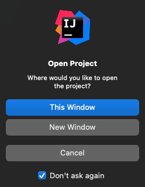
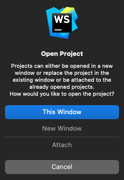
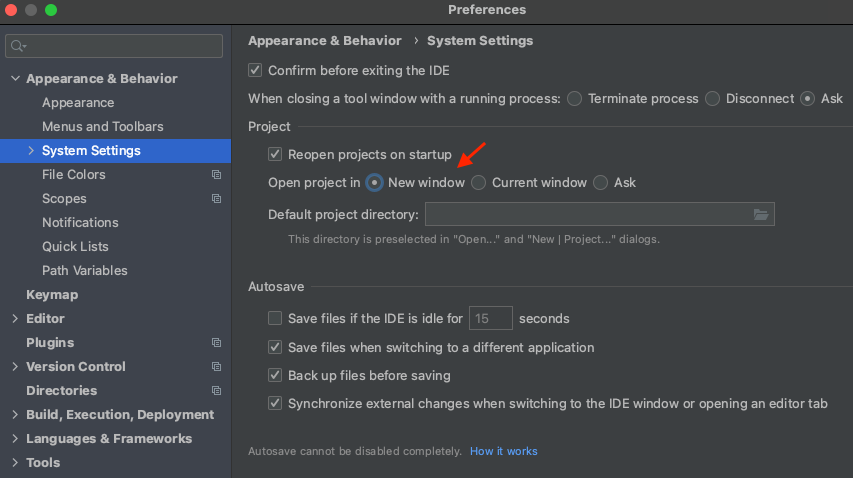

JetBrains Toolbox App으로 해당 기능을 지원하고 기타 JetBrains 도구에도 동일하게 적용 된다.

### 1


툴박스 오른쪽 상단에 육각 나사 아이콘을 선택한다.

### 2


Shell Scripts 항목의 Generate shell scripts 항목을 활성화 한다.  
Shell scripts location에 /usr/local/bin 을 입력한다. 또는 PATH 환경변수에서 사용하는 경로를 입력한다.

### 3


도구에 해당하는 육각 나사 아이콘을 선택하고 팝업 메뉴에서 Settings 항목을 선택한다.

### 4


IntelliJ의 경우 Shell script name이 idea로 되어있다.  
기본 이름 대신 원하는 이름으로 바꿀 수도 있다.  
만약 항목이 표시되지 않는다면 Toolbox를 종료하고 다시 열어보면 표시되어있다.

### 6
터미널에서 명령어를 입력하면 IntelliJ가 실행된다.
```bash
idea
```

디렉토리를 매개변수로 입력할 수 있다. 현재 디렉토리를 열 경우 다음과 같다.
```bash
idea ./
```

### 5


New Window를 선택하여 프로젝트를 새로운 윈도우로 연다.  
IntelliJ의 경우 Don't ask again을 선택하면 열때 마다 선택하지 않아서 편리하다. 



WebStorm은 경우 Don't ask again가 없어서 열때 마다 선택해야 해서 귀찮다.



환경설정을 열고 Appearance & Behavior > System Settings로 이동한다.  
Open project in New window를 선택하고 Apply 또는 OK로 저장한다.

### 참고자료
[IntelliJ IDEA Manual - Command-line interface](https://www.jetbrains.com/help/idea/working-with-the-ide-features-from-command-line.html)